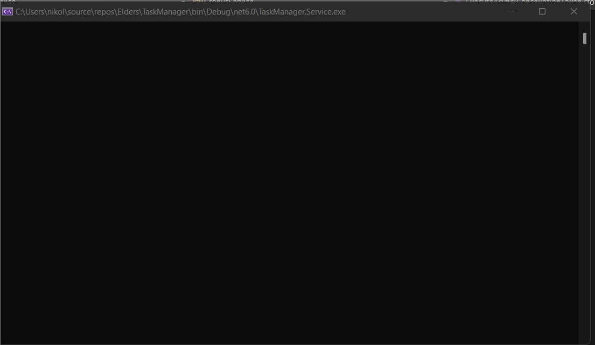

# Setup

### Creating a projects

Create a new console application project in a new folder using dotnet command.

```
> dotnet new console --name TaskManager.Service
```

Also, create a Web API project using the same folder for communicating with our Service. Then add both projects to the common solution.

```
 dotnet new webapi --name TaskManager.Api
```

Then we add the Cronus dependency.&#x20;

```shell
cd TaskManager.Api
dotnet add package Cronus

cd ../TaskManager.Service
dotnet add package Cronus
dotnet add package Cronus.Transport.RabbitMQ
dotnet add package Cronus.Persistence.Cassandra
dotnet add package Cronus.Serialization.NewtonsoftJson
dotnet add package Microsoft.Extensions.Hosting
```

This is the minimum set of packages for our Cronus host to work.

### Run docker images

* Setup Cassandra (Container memory is limited to 2GB):\
  <mark style="color:red;">`docker run --restart=always -d --name cassandra -p 9042:9042 -p 9160:9160 -p 7199:7199 -p 7001:7001 -p 7000:7000 cassandra`</mark>
* Setup RabbitMq (Container memory is limited to 512MB):\
  <mark style="color:red;">`docker run --restart=always -d --hostname node1 -e RABBITMQ_NODENAME=docker-UNIQUENAME-rabbitmq --name rabbitmq -p 15672:15672 -p 5672:5672 elders/rabbitmq:3.8.3`</mark>

### Setup configuration file

Add _appsettings.json_ with the following configuration into the project folder.


```json
{
  "Cronus": {
    "BoundedContext": "taskmanager",
    "Tenants": [ "tenant" ],
    "Transport": {
      "RabbitMQ": {
        "Server": "127.0.0.1",
        "VHost": "taskmanager"
      }
    },
    "Persistence": {
      "Cassandra": {
        "ConnectionString": "Contact Points=127.0.0.1;Port=9042;Default Keyspace=taskmanager_es"
      }
    }
  }
}
```


You can also see how the Cronus application can be configured in more detail in [Configuration.](../../cronus-framework/configuration.md)

### F5&#x20;


